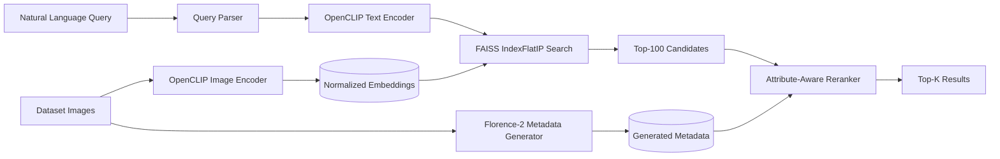
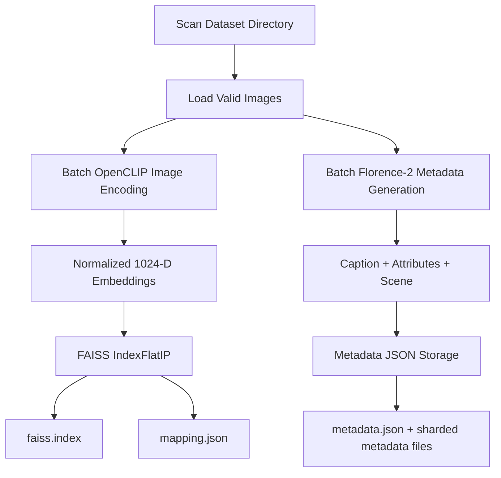
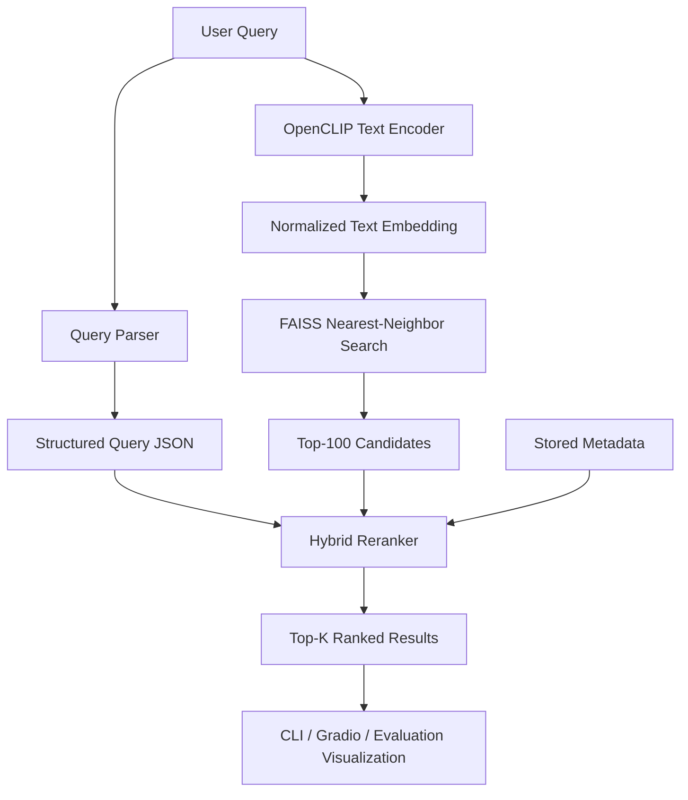

# fashion-multimodal-retrieval

A production-oriented multimodal fashion retrieval system that combines global vision-language embeddings, structured fashion metadata, and scalable vector search to retrieve visually and semantically relevant outfits from an unlabeled image collection.

## 1. Project Overview

This project is designed as an end-to-end retrieval pipeline for the Fashionpedia test split, where only raw images are available and no captions, annotations, or labels are provided. The system builds an index over the image collection, enriches each image with generated metadata, and supports natural-language fashion search such as:

- `Professional business attire inside a modern office.`
- `Someone wearing a blue shirt sitting on a park bench.`
- `A red tie and a white shirt in a formal setting.`

The implementation is structured as a modular Python 3.12 project with YAML-based configuration, logging, batch inference, resumable indexing, FAISS-based retrieval, a CLI, evaluation utilities, and a Gradio app.

## 2. Problem Statement

Fashion retrieval is harder than generic image retrieval because users often describe images compositionally. A useful system must understand not only the overall look of an image, but also fine-grained details such as garment types, colors, accessories, and scene context.

For example, the query `someone wearing a blue shirt sitting on a park bench` requires the system to jointly reason about:

- the upper garment type: `shirt`
- the garment color: `blue`
- the scene: `park`
- contextual cues: `bench`, `sitting`

The Fashionpedia test split makes this harder because it provides only image files. There is no supervised metadata to index directly, so the system must generate the structure it needs during preprocessing.

## 3. Architecture Diagram



## 4. Why Vanilla CLIP Is Insufficient for Compositional Fashion Retrieval

Vanilla CLIP is strong at matching global image and text semantics, but it is not enough on its own for compositional fashion retrieval.

Key limitations:

- It tends to represent the image holistically, which can underweight small but important fashion details such as ties, hats, handbags, or footwear.
- It does not explicitly expose structured fields like `upper_color`, `outerwear`, or `scene`, which are useful for precise filtering and reranking.
- It can confuse concept co-occurrence. A query mentioning both clothing and environment may retrieve images that match only one side well.
- It is not optimized for late-stage decision making where attribute-level evidence should override weak global similarity.

In practice, CLIP is an excellent first-stage retriever, but not a complete fashion search system. A stronger design uses CLIP for high-recall retrieval and then injects generated structure to improve precision.

## 5. Chosen Hybrid Architecture

The system uses a hybrid architecture that separates high-recall retrieval from fine-grained reranking.

### OpenCLIP for Global Image/Text Embeddings

OpenCLIP with `ViT-H-14` and `laion2b_s32b_b79k` is used to encode:

- images during indexing
- natural-language queries during retrieval

This gives a shared embedding space for efficient first-stage nearest-neighbor search.

### Florence-2 for Caption and Structured Attribute Generation

Because the dataset has no annotations, Florence-2 is used to generate:

- a free-form caption
- scene description
- structured fashion attributes
- dominant colors

This converts raw images into searchable multimodal metadata without requiring manual labels.

### FAISS for Scalable Nearest-Neighbor Search

FAISS `IndexFlatIP` stores normalized CLIP embeddings and supports fast similarity search over the image corpus. Metadata is stored outside the index so retrieval infrastructure stays independent from business logic.

### Query Parser

A query parser converts free-form user text into a fixed schema with fields such as:

- `scene`
- `style`
- `upper_garment`
- `upper_color`
- `lower_garment`
- `keywords`

This structured representation is later used by the reranker.

### Attribute-Aware Reranking

After first-stage retrieval, candidates are reranked with a weighted scoring function that combines:

- CLIP similarity
- caption similarity
- attribute matches
- scene consistency

This improves compositional retrieval quality compared with embedding similarity alone.

## 6. Indexing Pipeline

The indexing stage converts a folder of unlabeled images into searchable vector and metadata artifacts.



### Implemented Behavior

- recursively scans the dataset directory
- ignores corrupted images during discovery
- batches model inference
- saves progress after each batch
- resumes interrupted indexing
- skips images that are already processed

### Output Artifacts

Indexing writes the following artifacts under `outputs/`:

- `faiss.index`
- `mapping.json`
- `metadata.json`
- `metadata/` sharded per-image JSON files

## 7. Retrieval Pipeline

The retrieval stage combines semantic search with structured reranking.



### Reranking Scores

The final reranking score is computed as:

`0.45 * CLIP + 0.20 * Caption + 0.20 * Attribute + 0.15 * Scene`

This keeps the retrieval system high-recall in the first stage and high-precision in the final stage.

## 8. Repository Structure

```text
fashion-multimodal-retrieval/
├── configs/
│   └── config.yaml
├── data/
│   ├── processed/
│   └── raw/
├── indexer/
│   ├── attribute_extractor.py
│   ├── build_index.py
│   ├── caption_generator.py
│   ├── dataset.py
│   ├── image_encoder.py
│   ├── metadata_generator.py
│   └── scene_encoder.py
├── models/
├── outputs/
├── retriever/
│   ├── query_parser.py
│   ├── reranker.py
│   ├── retrieve.py
│   ├── search.py
│   ├── text_encoder.py
│   └── visualization.py
├── utils/
│   ├── config.py
│   └── logger.py
├── vector_db/
│   └── faiss_manager.py
├── app.py
├── evaluate.py
├── metadata.py
├── requirements.txt
└── README.md
```

## 9. Installation

### Environment

- Python `3.12`
- Recommended: a virtual environment
- Optional but preferred: CUDA-enabled GPU for OpenCLIP and Florence-2 inference

### Setup

```bash
cd fashion-multimodal-retrieval
python3.12 -m venv .venv
source .venv/bin/activate
pip install --upgrade pip
pip install -r requirements.txt
```

### Notes

- The code automatically uses CUDA if it is available.
- If GPU is not available, the pipeline falls back to CPU, but indexing will be slower.

## 10. Dataset Preparation

The current implementation assumes the Fashionpedia test split contains only image files and no annotations.

Place the images inside a directory named `test/` at the project root:

```text
fashion-multimodal-retrieval/
├── test/
│   ├── 000001.jpg
│   ├── 000002.jpg
│   └── ...
```

Supported file extensions:

- `.jpg`
- `.jpeg`
- `.png`

The dataset loader recursively scans this directory and creates one `image_id` per valid image. No labels or synthetic metadata are created at the dataset-loading stage.

## 11. How to Build the Index

Run the indexing pipeline from the project root:

```bash
python indexer/build_index.py
```

What this step does:

1. discovers all valid images
2. encodes them with OpenCLIP
3. generates captions and attributes with Florence-2
4. saves metadata to disk
5. builds the FAISS index
6. persists artifacts for later retrieval

The indexing pipeline is resumable. If interrupted, rerunning it will skip already indexed images when the full artifact set is present.

If you want to change dataset paths, batch size, output directories, or model settings, update `configs/config.yaml` before running the script.

## 12. How to Run Retrieval

### Command-Line Retrieval

```bash
python retriever/retrieve.py \
  --query "Professional business attire inside a modern office." \
  --top_k 10
```

This runs:

1. query parsing
2. OpenCLIP text encoding
3. FAISS nearest-neighbor retrieval
4. top-100 candidate collection
5. hybrid reranking
6. final top-k formatting

### Gradio Application

```bash
python app.py
```

The app loads FAISS and metadata once at startup and exposes:

- query textbox
- top-k slider
- search button
- result gallery
- metadata panel
- execution time display

## 13. Example Queries

- `A person in a bright yellow raincoat.`
- `Professional business attire inside a modern office.`
- `Someone wearing a blue shirt sitting on a park bench.`
- `Casual weekend outfit for a city walk.`
- `A red tie and a white shirt in a formal setting.`
- `Black outerwear with a handbag in an urban street scene.`
- `A summer dress with light colors outdoors.`

## 14. Scalability Discussion

The system is designed to scale beyond one million images with a clean separation between vectors, IDs, and metadata.

### Current Design Choices That Support Scale

- FAISS is used for dense vector retrieval instead of linear scans.
- Embeddings are stored as normalized `float32` arrays, which keeps memory layout simple and efficient.
- Metadata is stored outside FAISS, so vector search remains lightweight.
- A `vector_id -> image_id -> metadata` mapping decouples retrieval infrastructure from application logic.
- Indexing is batched and resumable, which is important for long-running large-corpus jobs.

### Practical Considerations for 1M+ Images

For one million images with 1024-dimensional `float32` embeddings:

- raw embedding storage is on the order of a few gigabytes
- metadata storage must be managed separately and preferably sharded
- indexing throughput becomes GPU-bound for encoding and I/O-bound for persistence

### Next Scaling Steps

For even larger datasets, the following upgrades would be natural:

- switch from `IndexFlatIP` to an approximate FAISS index such as IVF or HNSW
- shard metadata into larger partition files or move it to a document store
- add distributed embedding generation workers
- precompute text-side caches for repeated benchmark queries

## 15. Future Work

- Add city/place metadata to strengthen location-aware retrieval.
- Integrate weather information for season- and climate-aware search.
- Fine-tune the retrieval stack on Fashionpedia when labeled supervision is available.
- Replace late fusion with a multimodal cross-encoder reranker.
- Add person-level detection for multi-person images so each outfit can be indexed separately.

## Additional Notes

### Configuration

Runtime configuration is stored in `configs/config.yaml`. It defines:

- dataset and output paths
- logging behavior
- model names
- indexing batch size and worker count
- retrieval defaults
- app host and port

### Evaluation

The repository includes an `evaluate.py` script that runs a fixed five-query benchmark, saves retrieval visualizations, and writes a markdown report. Since the Fashionpedia test split has no ground-truth labels, `Precision@K` and `Recall@K` are intentionally left as future hooks in the evaluation code.

### Submission Framing

This project is intentionally structured as an engineering-oriented retrieval system rather than a notebook prototype. The focus is on modularity, reproducibility, scalability, and clean separation between indexing, search, reranking, evaluation, and application layers.
